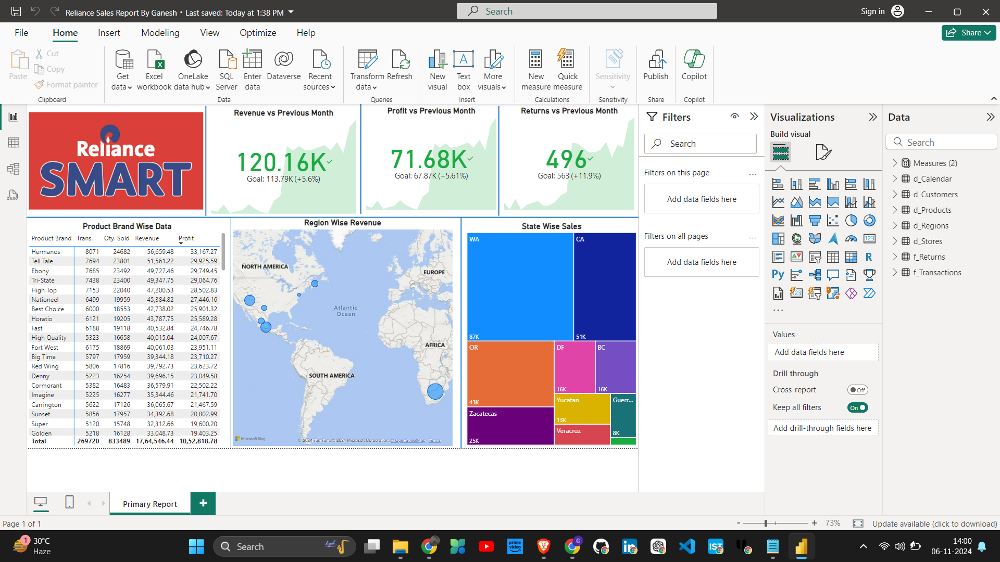
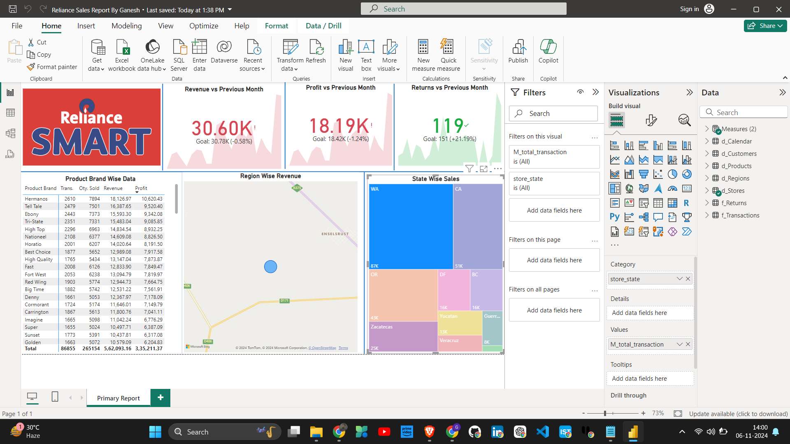
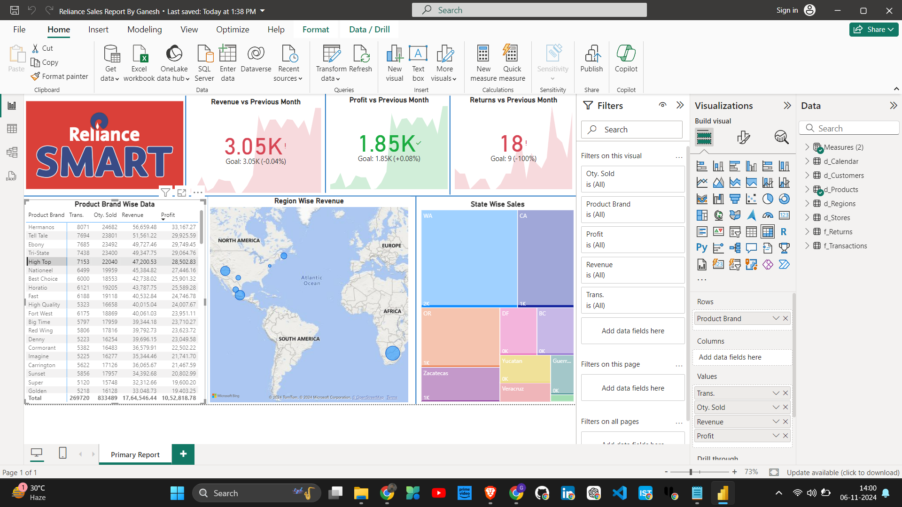
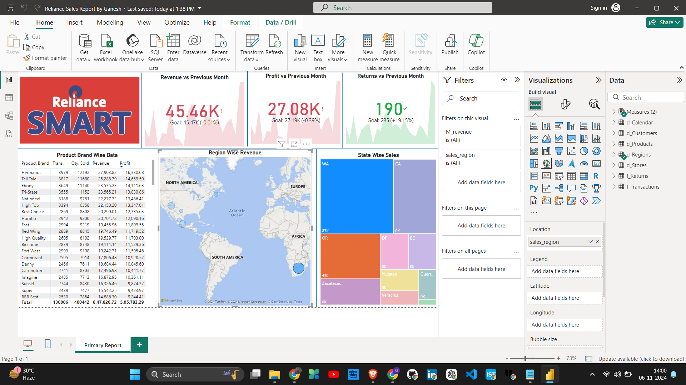

# Reliance Sales Report

**Dashboard Link**: [Reliance Sales Report Dashboard](https://1drv.ms/u/c/3a7465b5181c39f2/EWe3sItTtadJgvNwq1IoxwoBj_Y6tSLymYMjJC6nK2HWxA?e=9rWleO)

This repository hosts the Power BI project for the **Reliance Sales Report**, a comprehensive and interactive dashboard designed to visualize and analyze sales data effectively. This report provides valuable insights into sales performance, trends, and other essential metrics.

## Project Overview

In this project, the **ETL (Extract, Transform, Load)** process was meticulously followed to clean, transform, and model the data, ensuring high-quality input for the Power BI report. The final result is an interactive Power BI report that allows users to explore data across multiple dimensions, making it easier to derive actionable insights.

## Project Features

- **Data Cleaning and Transformation**: Comprehensive ETL process to remove inconsistencies and ensure data accuracy.
- **Sales Insights**: Displays sales trends, top-performing products, regional performance, and more.
- **Interactive Visuals**: Filter and drill down by product, region, time period, and other dimensions.
- **User-Friendly Interface**: Designed for intuitive navigation and understanding of data.

## Screenshots

Here are some screenshots of the Power BI report for a quick preview:

### Sales Dashboard


### Product Analysis


### Regional Performance


### Monthly Sales Trends



## Getting Started

1. **Clone this Repository**:
    ```bash
    git clone https://github.com/ganeshagrahari/Reliance-Sales-Report-PowerBi.git
    ```

2. **Download the Power BI File**:
   - Access and download the Power BI report file from the [dashboard link](https://1drv.ms/u/c/3a7465b5181c39f2/EWe3sItTtadJgvNwq1IoxwoBj_Y6tSLymYMjJC6nK2HWxA?e=9rWleO).

3. **Open in Power BI Desktop**:
   - Open the downloaded `.pbix` file using Power BI Desktop.
   - Ensure your data source connections are correctly set up if you wish to refresh the data.

## Requirements

- **Power BI Desktop**: Download from [Microsoft's official website](https://powerbi.microsoft.com/).
- **Data Source**: Ensure access to the required data sources if you're looking to refresh or update the report.

## ETL Process

The ETL (Extract, Transform, Load) process was implemented as follows:

1. **Extract**: Data extracted from raw sources.
2. **Transform**: Data was cleaned, formatted, and structured for reporting, handling missing values, and ensuring consistency.
3. **Load**: Data was loaded into Power BI for visualization and analysis.

## Usage

- Open the Power BI file to explore various insights by using slicers and filters.
- Navigate through the different pages of the report to view various sales insights.

## Contribution

Feel free to fork this repository, open issues, or submit pull requests if you have suggestions for improvements.

## License

This project is licensed under the MIT License - see the [LICENSE](LICENSE) file for details.
